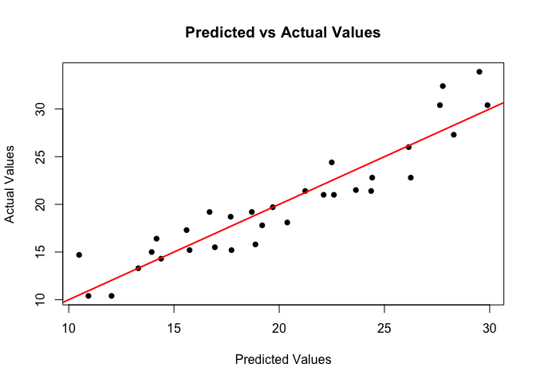

<!-- README.md is generated from README.Rmd. Please edit that file -->

# mathcalculate

<!-- badges: start -->

[](https://github.com/SihanChenn/mathcalculate/actions/workflows/R-CMD-check.yaml)

[](https://app.codecov.io/gh/SihanChenn/mathcalculate?branch=main)
<!-- badges: end -->

The goal of mathcalculate is to compute linear regression models using
least square method, and get a result about estimated coefficients
(including estimated coefficients, standard error of estimated
coefficients, t statistics and p-value) and estimated Y. Be careful that
to run this package, both X and Y should not have any NA values.

This package contains two functions. “linear_regress” is to compute
linear regression models and get estimated coefficients. “PredictedY” is
to get predicted values for a linear regression.

Please see help page in R package for more detailed information about
these two functions.

## Installation

You can install the development version of mathcalculate from
[GitHub](https://github.com/) with:

``` r
# install.packages("devtools")
devtools::install_github("SihanChenn/mathcalculate")
```

## Example

This is a basic example which shows you how to use this package:

``` r
library(mathcalculate)
#basic example code
data("mtcars")
#set up x and y
y = mtcars$mpg
x = as.matrix(mtcars[, -which(names(mtcars) == "mpg")])
#get linear regression results using linear_regress
result = linear_regress(y, x)
#get predicted values from PredictY
y_hat = PredictY(x, result[["Estimate"]])
# results
print(result)
#> $Estimate
#> (Intercept)        xcyl       xdisp         xhp       xdrat         xwt 
#> 12.30337416 -0.11144048  0.01333524 -0.02148212  0.78711097 -3.71530393 
#>       xqsec         xvs         xam       xgear       xcarb 
#>  0.82104075  0.31776281  2.52022689  0.65541302 -0.19941925 
#> 
#> $Std_Err
#> (Intercept)        xcyl       xdisp         xhp       xdrat         xwt 
#> 18.71788443  1.04502336  0.01785750  0.02176858  1.63537307  1.89441430 
#>       xqsec         xvs         xam       xgear       xcarb 
#>  0.73084480  2.10450861  2.05665055  1.49325996  0.82875250 
#> 
#> $t_statistic
#> (Intercept)        xcyl       xdisp         xhp       xdrat         xwt 
#>   0.6573058  -0.1066392   0.7467585  -0.9868407   0.4813036  -1.9611887 
#>       xqsec         xvs         xam       xgear       xcarb 
#>   1.1234133   0.1509915   1.2254035   0.4389142  -0.2406258 
#> 
#> $p_value
#> (Intercept)        xcyl       xdisp         xhp       xdrat         xwt 
#>  0.51812440  0.91608738  0.46348865  0.33495531  0.63527790  0.06325215 
#>       xqsec         xvs         xam       xgear       xcarb 
#>  0.27394127  0.88142347  0.23398971  0.66520643  0.81217871
print(y_hat)
#>        1        2        3        4        5        6        7        8 
#> 22.59951 22.11189 26.25064 21.23740 17.69343 20.38304 14.38626 22.49601 
#>        9       10       11       12       13       14       15       16 
#> 24.41909 18.69903 19.19165 14.17216 15.59957 15.74222 12.03401 10.93644 
#>       17       18       19       20       21       22       23       24 
#> 10.49363 27.77291 29.89674 29.51237 23.64310 16.94305 17.73218 13.30602 
#>       25       26       27       28       29       30       31       32 
#> 16.69168 28.29347 26.15295 27.63627 18.87004 19.69383 13.94112 24.36827
```

Scatter plot for predicted y v.s. actual y.


